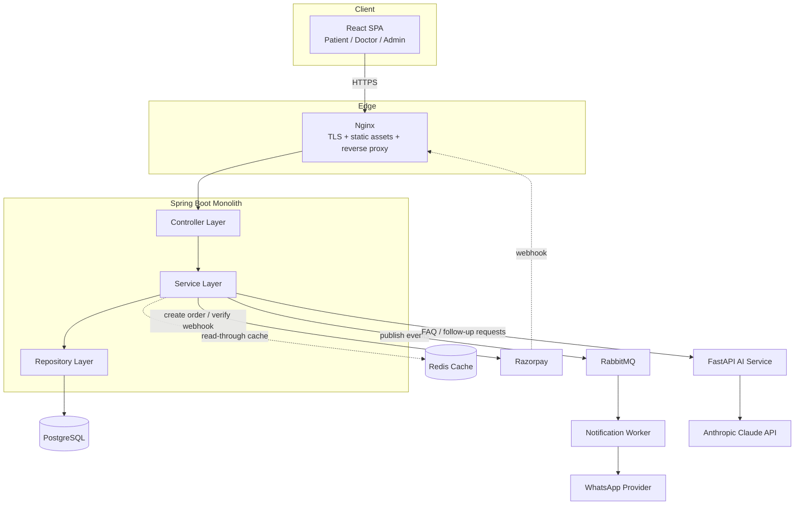
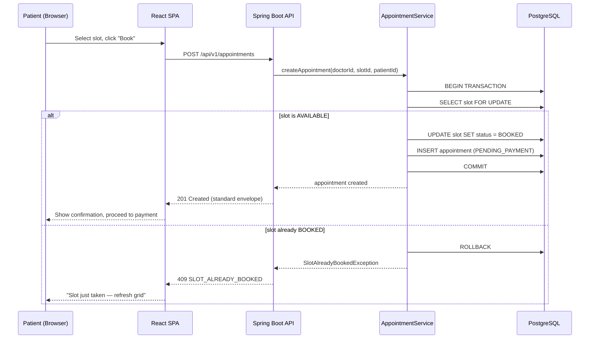
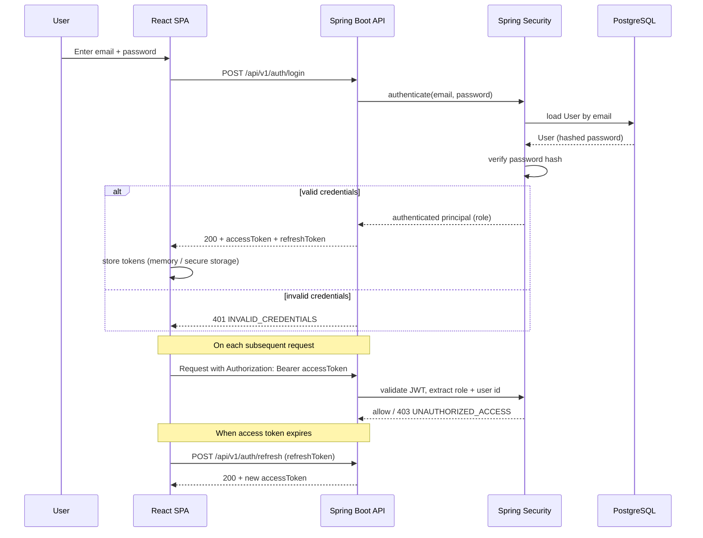
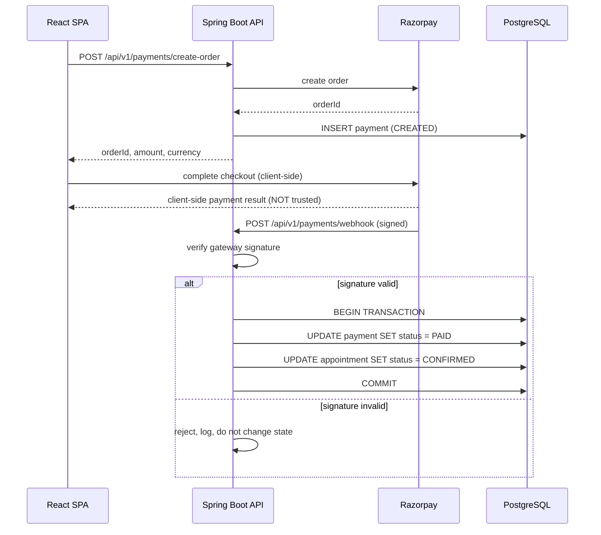
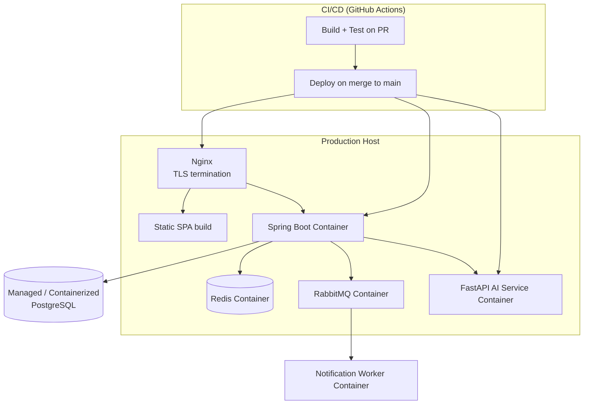

# Cliniva — Technology Stack & System Architecture

**Version:** 1.0
**Companion documents:** `product-description.md`, `design.md`

This document defines the full technology stack, system architecture, and phased implementation roadmap for Cliniva. The **backend stack (Java 21, Spring Boot, PostgreSQL, Maven, Lombok, Docker Compose, with Redis/RabbitMQ/Razorpay/FastAPI planned) is already decided** by the team and is treated here as fixed; this document formalizes it and fills in the frontend, infra, and architecture decisions needed to implement `product-description.md`.

---

## 1. Frontend

| Area | Choice | Why |
|---|---|---|
| Framework | **React 18+ with Vite** | Fast dev server, wide ecosystem, easy to hand off to an AI coding agent incrementally screen-by-screen. Alternative considered: Next.js — rejected for MVP because Cliniva's backend is a separate Spring Boot API (no need for Next's server-rendering/API-route features), and Vite's simpler build keeps the frontend decoupled and easy to deploy as a static bundle behind the same reverse proxy as the API. |
| Language | **TypeScript** | Request/response shapes are already strictly contracted (see API contract's standard envelope) — TypeScript interfaces generated from that contract catch integration bugs at compile time instead of runtime. |
| UI library / components | **Tailwind CSS + a headless component primitive set (Radix UI)** | Matches `design.md`'s flat, technical, low-decoration visual language; Tailwind's utility classes map directly onto the design tokens (colors, spacing, radius) defined there. Radix provides accessible unstyled primitives (dialog, dropdown, tabs) so accessibility (§3.7 of `design.md`) isn't reinvented per component. |
| Styling approach | **Tailwind CSS**, with design tokens (`design.md` §1.3–1.7) wired in as CSS variables / Tailwind theme extension. | Keeps styling co-located with markup, fast to iterate for an AI coding agent, avoids a separate CSS-in-JS runtime cost. |
| State management | **TanStack Query (server state) + React Context/useState (local UI state)** | Almost all state in Cliniva is server state (doctors, slots, appointments) that needs caching, refetching, and optimistic updates (e.g. removing a slot from the grid the instant it's booked). A dedicated global client-state library (Redux) is unnecessary complexity for this app's actual state shape. |
| Form handling | **React Hook Form + Zod** | Zod schemas double as runtime validation and TypeScript types; maps cleanly onto the backend's `422 VALIDATION_ERROR` `errors[]` field/message pairs for inline form errors. |
| Data fetching | **TanStack Query** on top of a typed `fetch` wrapper (Axios or native `fetch`) | Built-in caching, retry, and background refetch — important for the slot grid, which must reflect near-real-time availability. |
| Routing | **React Router v6** | Standard, well-documented, supports the nested layouts needed for the sidebar app shell vs. the linear patient booking flow described in `design.md` §2.1/§3.1. |
| Validation | **Zod**, shared schema shapes mirrored from backend DTOs | Single source of truth for form validation rules that should match backend `@Valid` constraints. |
| Charts / visualization | **Recharts** (only needed once the admin analytics dashboard, `product-description.md` §17 Future Features, is built) | Not required for MVP; deferred until analytics ships. |
| Testing | **Vitest + React Testing Library** for unit/component tests, **Playwright** for end-to-end flows (booking flow, cancel/reschedule) | Playwright specifically covers the concurrency-sensitive user journey (two browser contexts racing to book the same slot) end-to-end. |
| Build tooling | **Vite** | Already selected as the framework tool above; fast HMR, simple production build to static assets. |

---

## 2. Backend

*(Already decided by the team; recorded here for completeness and to anchor the architecture sections below.)*

| Area | Choice | Why |
|---|---|---|
| Backend framework | **Spring Boot** | Team's existing choice; mature ecosystem for Spring Security, JPA, validation, and transaction management — all directly needed by the product's hardest requirement (no double-booking). |
| Language | **Java 21** | LTS release with virtual threads available, useful later if the booking path becomes I/O-bound under load (Redis/RabbitMQ calls) without needing a reactive rewrite. |
| API architecture | **REST**, layered monolith: Controller → Service → Repository → PostgreSQL (per the team's existing package structure: `controller`, `service`, `repository`, `entity`, `dto/{request,response}`, `security`, `exception`, `config`, `mapper`) | A monolith is the right call for a small-team, MVP-stage product — one deployable, one transaction boundary for the critical booking path (§4.3 below), no premature microservice complexity. |
| Authentication | **Spring Security + JWT** (access + refresh token pair, per API contract §8) | Stateless auth suits a REST API with a decoupled SPA frontend and, later, mobile clients. |
| Authorization | **Role-based access control** (`PATIENT`, `DOCTOR`, `ADMIN`) enforced via Spring Security method/URL security, backed by ownership checks in the service layer (e.g. "this appointment belongs to this patient") that a role check alone cannot express. |
| Validation | **Jakarta Bean Validation (`@Valid`)** on request DTOs, mapped by a global `@ControllerAdvice` to the standard `VALIDATION_ERROR` envelope (API contract §7a) | Already the team's designed integration boundary between Anuj's DTO/validation layer and the shared error contract. |
| Background jobs | **Spring `@Scheduled`** for slot generation (materializing `Slot` rows from `DoctorAvailability` ahead of the booking window) in MVP; **RabbitMQ consumers** for reminder delivery and AI follow-up dispatch once those phases ship | Slot generation is a simple periodic job; notification/AI dispatch is event-driven and benefits from a real queue for retry/backoff semantics. |
| File handling | Not required for MVP (no document/image upload in the current API contract) — revisit if clinic logos or patient document uploads are added later. |
| Logging | **SLF4J + Logback** (Spring Boot default), structured JSON logging in production, correlated via the `requestId` already present in every API response envelope | Lets ops trace a specific failed request end-to-end across logs using the same `requestId` the client sees. |
| Error handling | Global `@ControllerAdvice` mapping domain exceptions → canonical `ErrorCode` enum → standard error envelope, exactly as defined in the existing API contract §7a. |

---

## 3. Database

| Area | Choice | Why |
|---|---|---|
| Primary database | **PostgreSQL** | Already the team's choice; strong transactional guarantees and row-level locking primitives (`SELECT ... FOR UPDATE`) are exactly what the no-double-booking requirement needs. |
| Schema approach | Normalized relational schema mirroring the entities in `product-description.md` §12 (`User`, `Doctor`, `Patient`, `Clinic`, `DoctorAvailability`, `Slot`, `Appointment`, `Payment`, `Notification`, `AiInteraction`), UUID primary keys, `@MappedSuperclass` audit base entity (`createdAt`/`updatedAt`) — matching the team's existing `BaseEntity` pattern. |
| ORM / query layer | **Spring Data JPA (Hibernate)** for standard CRUD, with **explicit native/JPQL queries using pessimistic locking** for the slot-booking write path specifically (see §4.3) — don't rely on default JPA optimistic locking alone for that path. |
| Migrations | **Flyway**, versioned SQL migrations under `src/main/resources/db/migration`, matching the repository structure already defined in the API contract §4 | Explicit, reviewable SQL migrations are safer than relying on Hibernate's `ddl-auto` for a schema this consistency-sensitive. |
| Indexing strategy | Unique constraint on `(doctor_id, date, start_time)` at the `Slot` level as a defense-in-depth layer under the pessimistic lock; index on `Appointment.patient_id`, `Appointment.doctor_id`, `Slot.status`, and `Slot.date` for the hot query paths (patient's appointment list, doctor's daily schedule, slot availability lookup). |
| Caching | **Redis** (already planned) for read-heavy, less-volatile lookups — doctor profile/list, clinic details. **Not** used as the source of truth for slot availability at booking time (the DB transaction is authoritative); Redis may cache slot *read* responses with a short TTL and must be invalidated/bypassed on the write path. |
| Data storage requirements | Standard relational storage; no object/blob storage required for MVP (see File handling above). |

---

## 4. Infrastructure

| Area | Choice | Why |
|---|---|---|
| Hosting | **Any managed container platform** (e.g. a small VM or managed container service) is sufficient at MVP scale — this document intentionally avoids over-specifying a cloud vendor since none is mandated by the product requirements; pick based on the team's existing familiarity/cost constraints. |
| Containerization | **Docker Compose** (already the team's choice) for local dev (Postgres already running this way per the team's setup notes) and as the basis for a straightforward Docker-based production deploy (backend image + Postgres + Redis + RabbitMQ, one `docker-compose.prod.yml`). |
| Reverse proxy / API gateway | **Nginx** (or an equivalent managed load balancer) in front of the Spring Boot app and the static frontend build — terminates TLS, serves the SPA's static assets, proxies `/api/v1/*` to the backend. |
| CI/CD | **GitHub Actions** (repo already lives on GitHub — `github.com/anujsh2004/Cliniva`) — build + test on every PR, deploy on merge to `main`, matching the team's existing "PRs before merging to main" Git workflow. |
| Environment management | `.env`-based configuration per environment (local/staging/prod), Spring profiles (`application-{profile}.yml`), secrets injected via CI/CD secret store — never committed, per the team's existing rule that JWT secrets/DB credentials are never committed to Git. |
| Monitoring | **Spring Boot Actuator** exposing health/metrics, scraped by **Prometheus**, visualized in **Grafana** — lightweight, standard for a Spring Boot stack, and the existing `/api/v1/health` endpoint is already the right foundation for this. |
| Logging | Centralized log aggregation (e.g. Loki, or a hosted log service) ingesting the structured JSON logs described in §2, queryable by `requestId`. |
| Backups | Automated daily PostgreSQL backups with point-in-time recovery where the hosting platform supports it; backup/retention policy to be finalized with the team (flagged as an open question in `product-description.md` §22). |
| Security | HTTPS everywhere (TLS termination at the reverse proxy), JWT secret rotation policy, dependency scanning in CI, rate limiting on `/auth/*` endpoints to slow credential-stuffing attempts, and the payment-webhook signature verification already mandated by the API contract (§14). |

---

## 5. Third-Party Services

Only services with a clear, already-stated product requirement are included:

| Service | Purpose | Contract basis |
|---|---|---|
| **Razorpay** | Payment gateway for appointment payments | API contract §14 (`gateway: RAZORPAY`), `product-description.md` §8.6 |
| **WhatsApp Business API** (via a provider such as Twilio or a WhatsApp BSP) | Reminder delivery channel | API contract §15 (`channel: WHATSAPP`) |
| **Anthropic Claude API** (via the planned FastAPI AI layer) | Powers the AI FAQ and post-visit follow-up features | API contract §16, `product-description.md` §8.8 |

Not recommended at this stage (no stated requirement): a separate auth provider (JWT is already specified and sufficient), object storage (no file upload requirement), a dedicated search service (doctor list is small-scale, paginated Postgres queries suffice), a third-party analytics/error-tracking SaaS (can be added later without affecting the API contract — Sentry for error tracking is a reasonable low-cost addition once the team wants it, but is not required to hit MVP acceptance criteria).

---

## 6. System Architecture

### 6.1 High-Level System Architecture

**Why this shape:** the Spring Boot monolith remains the single source of truth and the only writer to PostgreSQL, which is what makes the no-double-booking guarantee possible (one transaction boundary, not a distributed one). Redis and RabbitMQ are additive side-channels — a cache and an async event bus — that can fail or be temporarily unavailable without breaking core booking correctness, satisfying the "add without breaking existing APIs" requirement from the product doc.

### 6.2 Frontend → API → Backend → Database Flow

**Why:** this is the concrete implementation of the concurrency-safety requirement from `product-description.md` §8.5 — the row-level lock (`SELECT ... FOR UPDATE`) inside a single DB transaction is what turns "two requests race for one slot" into "one wins, one gets a clean, expected error," rather than a data-corrupting double-write.

### 6.3 Authentication Flow

**Why:** stateless JWT auth matches a decoupled SPA + REST API architecture and avoids server-side session storage; the refresh flow keeps users logged in across a normal session without re-entering credentials, while access tokens stay short-lived to limit the blast radius of a leaked token.

### 6.4 Important Data Flow — Payment Confirmation (Webhook-Verified)

**Why:** the API contract is explicit that payment/appointment state must only change based on a **verified webhook**, never the client's own report of payment success — this prevents a manipulated client from marking an unpaid appointment as confirmed.

### 6.5 Deployment Architecture

**Why:** Docker Compose (already the team's local-dev tool) extends naturally into a production `docker-compose` or equivalent container orchestration setup without introducing Kubernetes-level complexity that this stage of the product doesn't need. All stateful services (Postgres) should be backed up independently of the stateless application containers, which can be redeployed freely.

---

## 7. Development Phases

### Phase 0 — Product & Technical Foundation
- **Objective:** validated requirements and a working local dev environment.
- **Tasks:** finalize `product-description.md` open questions with the team; confirm repository conventions (already defined in the API contract §4–5); set up Spring Boot project scaffold, PostgreSQL via Docker Compose, package structure, health endpoint (already complete per the team's own progress notes); set up frontend project scaffold (Vite + React + TypeScript + Tailwind).
- **Deliverables:** running `GET /api/v1/health`, running Postgres container, empty-but-structured frontend app, CI pipeline stub.
- **Dependencies:** none.
- **Definition of done:** both backend and frontend run locally end-to-end (frontend can call the health endpoint and render the result).

### Phase 1 — Design System & Application Shell
- **Objective:** implement the design tokens and layout shells from `design.md` before building real screens on top of them.
- **Tasks:** Tailwind theme configuration from `design.md` §1.3–1.7 tokens; `StatusBadge`, `ResponseToast`, `DataTable` shell components (§4 of `design.md`); app shell layout (sidebar + top header) and the patient-facing linear flow shell (`BookingStepper`); responsive breakpoints per `design.md` §3.8; routing skeleton.
- **Deliverables:** a navigable, unstyled-data shell app matching the design system, with placeholder screens for every route in `product-description.md` §6.
- **Dependencies:** Phase 0.
- **Definition of done:** every core route renders the correct layout shell and responds correctly across mobile/tablet/desktop breakpoints, with no real data yet.

### Phase 2 — Backend Foundation
- **Objective:** entities, migrations, auth, and authorization working end-to-end.
- **Tasks:** Flyway migrations for all core entities (§3 above); `User`/`Doctor`/`Patient` entities (already in progress per team notes); Spring Security + JWT implementation (register/login/refresh per API contract §8); role-based authorization; global exception handling + canonical `ErrorCode` mapping (API contract §7a).
- **Deliverables:** working `/auth/register`, `/auth/login`, `/auth/refresh`; role-protected endpoints returning correct `401`/`403` per the auth rules in `product-description.md` §11.
- **Dependencies:** Phase 0.
- **Definition of done:** a Postman/automated test suite proves each role can only access what it should, per the API contract's authorization rules.

### Phase 3 — Core Product Features (MVP)
- **Objective:** the full booking loop, working and concurrency-safe.
- **Tasks:** Doctor/Patient CRUD APIs; `DoctorAvailability` + `Slot` generation job; slot fetch endpoint; appointment create/cancel/reschedule with the pessimistic-locking transaction from §6.2; doctor daily-appointment view + complete action; frontend integration of the real booking flow (`SlotGrid`, `AppointmentCard`, `AvailabilityEditor`, `BookingStepper` from `design.md` §4) against these live APIs.
- **Deliverables:** everything listed as MVP in `product-description.md` §18, meeting the acceptance criteria in §21 — in particular, the concurrent-double-booking test must pass.
- **Dependencies:** Phase 1, Phase 2.
- **Definition of done:** all MVP acceptance criteria in `product-description.md` §21 are demonstrably met, including the two-simultaneous-bookings test.

### Phase 4 — Integration & Advanced Features
- **Objective:** payments, notifications, caching, and documentation.
- **Tasks:** Razorpay order creation + webhook verification (§6.4); RabbitMQ notification worker + WhatsApp delivery; Redis caching for doctor/clinic reads; Swagger/OpenAPI generation; full integration test suite (per the team's own Sprint 4 plan).
- **Deliverables:** working end-to-end payment confirmation flow; 24-hour reminder delivery; cached doctor list reads; published API docs.
- **Dependencies:** Phase 3.
- **Definition of done:** a real (sandbox) Razorpay payment confirms an appointment via webhook only; a scheduled reminder is actually delivered via the WhatsApp provider in a staging environment.

### Phase 5 — Testing & Hardening
- **Objective:** production-readiness across correctness, security, and performance.
- **Tasks:** expand unit/integration test coverage (backend: service-layer + repository-layer, especially the locking path; frontend: Vitest component tests); Playwright E2E covering the full booking journey and the concurrency race; basic security testing (auth bypass attempts, rate limiting on `/auth/*`); load testing the slot-fetch and booking endpoints; accessibility audit against `design.md` §3.7; error-state and empty-state review against `design.md` §2.12–2.14.
- **Deliverables:** test coverage report, load test results against NFR-8 (`product-description.md`), accessibility audit findings resolved.
- **Dependencies:** Phase 3, Phase 4.
- **Definition of done:** CI runs the full test suite on every PR and blocks merges on failure; load test confirms the sub-500ms slot-fetch target under expected concurrent load.

### Phase 6 — Deployment
- **Objective:** production infrastructure live.
- **Tasks:** production Docker Compose / container setup (§6.5); GitHub Actions deploy pipeline; environment/secret configuration; Actuator + Prometheus + Grafana monitoring; centralized logging; automated backups.
- **Deliverables:** live production environment, monitored and backed up, deployed via CI/CD on merge to `main`.
- **Dependencies:** Phase 5.
- **Definition of done:** a merge to `main` deploys automatically; health checks, metrics, and logs are all visible in the monitoring stack; a backup restore has been tested at least once.

### Phase 7 — Post-MVP
- **Objective:** AI layer and growth features.
- **Tasks:** FastAPI AI service (`/ai/faq`, AI follow-up generation) integrated with Claude; multi-clinic admin support; doctor search/filter by specialization; admin analytics dashboard (Recharts, per §1 above); SMS/email notification channels.
- **Deliverables:** as prioritized by the team post-launch, each scoped and added to a versioned API contract update per the existing "update the contract first, then implement" rule.
- **Dependencies:** Phase 6 (live in production with real usage data to prioritize against).

---

## 8. Recommended Implementation Order

Ordered to minimize rework, respecting the dependency chain above:

**Must-have (MVP):**
1. Backend project + Postgres + package structure + health endpoint *(already complete per team notes)*
2. `User`/`Doctor`/`Patient` entities + Flyway migrations *(already in progress)*
3. Auth: register/login/refresh + JWT + role-based authorization
4. Frontend shell: design tokens, layout, routing (can proceed in parallel with #3 once entities/API shapes are agreed)
5. Doctor & Patient profile APIs + frontend screens
6. `DoctorAvailability` + `Slot` generation + slot-fetch API + `SlotGrid` component
7. Appointment create (with pessimistic-locking transaction) + `BookingStepper`
8. Appointment cancel/reschedule + `AppointmentCard` actions
9. Doctor daily-schedule view + complete action
10. End-to-end concurrency test for double-booking (validate #7 before moving on)

**Important, post-MVP:**
11. Razorpay payment integration (order + webhook)
12. RabbitMQ + WhatsApp reminder worker
13. Redis caching for read-heavy endpoints
14. Swagger/OpenAPI + full integration test suite
15. Production deployment pipeline + monitoring

**Nice-to-have:**
16. AI FAQ + AI follow-up (FastAPI + Claude integration)
17. Admin analytics dashboard
18. Doctor search/filter by specialization
19. Multi-clinic admin support
20. Additional notification channels (SMS/email)

---

## 9. Assumptions & Open Questions

- **Frontend framework/stack** was not previously decided by the team (the existing project artifacts cover only the backend) — the choices in §1 are this document's recommendation, not a prior team decision, and should be confirmed with Anuj/Parth before frontend work starts.
- **Hosting provider** is intentionally left generic (§4) since no specific vendor is mandated by the product requirements; pick based on cost/familiarity and revisit if scale requirements change.
- **Slot-locking mechanism**: this document recommends pessimistic row locking (`SELECT ... FOR UPDATE`) over optimistic locking for the booking write path specifically, because the product's correctness requirement (never double-book) benefits from failing fast and predictably under contention rather than handling retries client-side. This should be confirmed against Parth's existing concurrency design work before implementation, since he already owns this area per the team's ownership contract.
- **Sentry/error-tracking and analytics services** are noted as reasonable low-cost future additions but are explicitly not required for MVP, per the "only recommend a service with a clear product requirement" rule.
